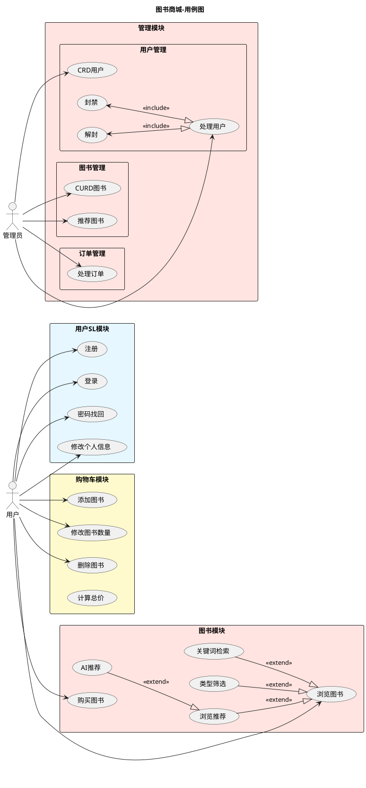
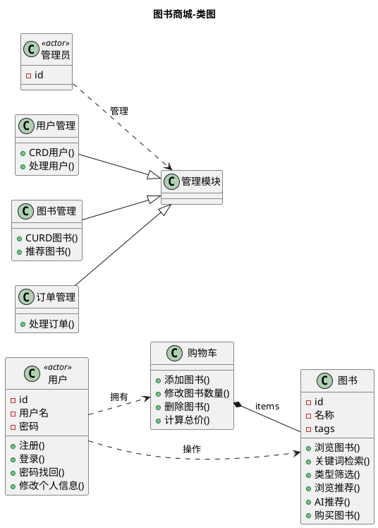

# 用例图

```plantuml
@startuml
title 图书商城-用例图
left to right direction

' -------------------- 角色 --------------------
actor 用户
actor 管理员

' -------------------- 模块 --------------------
rectangle "用户SL模块" as User #E6F7FF {
	(注册)
	(登录)
	(密码找回)
	(修改个人信息)
}

rectangle "购物车模块" as Cart #FFFACD {
	(添加图书)
	(修改图书数量)
	(删除图书)
	(计算总价)
}

rectangle "图书模块" as Book #FFE4E1 {
	(浏览图书)
	(关键词检索)
	(类型筛选)
	(浏览推荐)
	(AI推荐)
	(购买图书)
}
rectangle "管理模块" as Manager #FFE4E1 {
	rectangle "用户管理"{
		(CRD用户)
		(处理用户)
		(封禁)
		(解封)
	}
	rectangle "图书管理"{
		(CURD图书)
		(推荐图书)
	}
	rectangle "订单管理"{
		(处理订单)
	}
}

' -------------------- 关系梳理 --------------------
类型筛选--|> 浏览图书:<<extend>>
关键词检索--|> 浏览图书:<<extend>>
浏览推荐--|> 浏览图书:<<extend>>

AI推荐--|> 浏览推荐:<<extend>>

封禁 <--|> 处理用户:<<include>>
解封 <--|> 处理用户:<<include>>

' -------------------- 行为映射 --------------------
用户 --> (注册)
用户 --> (登录)
用户 --> (密码找回)
用户 --> (修改个人信息)

用户 --> (浏览图书)
用户 --> (购买图书)

用户 --> (添加图书)
用户 --> (删除图书)
用户 --> (修改图书数量)

管理员 --> (CRD用户)
管理员 --> (处理用户)
管理员 --> (CURD图书)
管理员 --> (推荐图书)
管理员 --> (处理订单)

@enduml
```

---
# 类图

```plantuml

@startuml
title 图书商城-类图
left to right direction

' -------------------- 角色 --------------------
class 用户 <<actor>>{
	-id
	-用户名
	-密码
    +注册()
    +登录()
    +密码找回()
    +修改个人信息()
}

class 管理员 <<actor>> {
	-id
}

' -------------------- 模块 --------------------
class 购物车 {
    +添加图书()
    +修改图书数量()
    +删除图书()
    +计算总价()
}

class 图书 {
	-id
	-名称
	-tags
	
    +浏览图书()
    +关键词检索()
    +类型筛选()
    +浏览推荐()
    +AI推荐()
    +购买图书()
}

class 用户管理 {
    +CRD用户()
    +处理用户()
}

class 图书管理 {
    +CURD图书()
    +推荐图书()
}

class 订单管理{
    +处理订单()
}

class 管理模块{
	
}

' -------------------- 模块关系 --------------------
用户管理--|> 管理模块
图书管理--|> 管理模块
订单管理--|> 管理模块

购物车 *-- 图书 : items


' -------------------- 角色依赖 --------------------
用户 ..> 购物车 :拥有
用户 ..> 图书 :操作

管理员 ..> 管理模块 :管理

@enduml

```